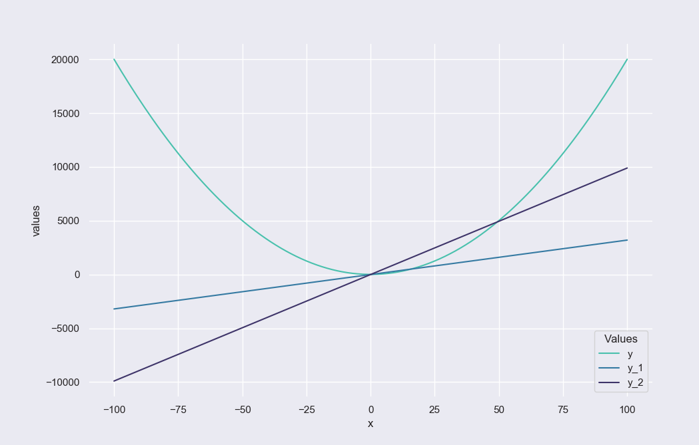
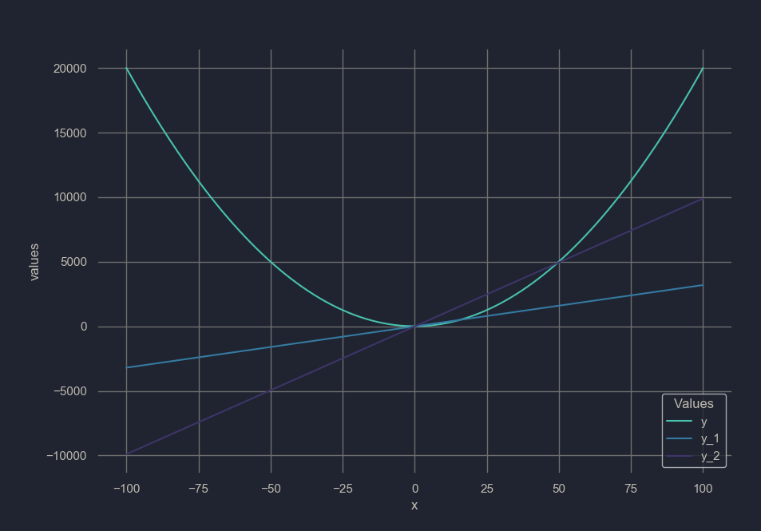

# Aesthetic-Graphing
An abstraction layer built on top of Seaborn to allow quick graphing and visualization of data

## Description
Properly theming and inputting the data for graphing can be a pain despite having very high level libraries at your disposal. This program makes the process easier by requiring no more than two lines of code for graphing a given dataset. 

## Usage
In order to use the class, do:
```python
from graph import Graph
```
There is a generator and two other functions included which aid in data creation. The class expects a `list of dictionaries`. Any number of datasets can be given and it will graph them all without any problems. A constant x range on all datasets is preferred but not required. There is a light and a dark theme. In order to choose either of them do the following when creating your object:
```python
myobject = Graph('dark')
```
For a light theme, write `light` when creating object. After that the `adddata` method takes the `list of dictionaries` and processes and graphs them automatically.

A full template program will look like this:

```python
from graph import *


def main():
	ranges = {"start":-2000,"end":2001}
	datalist = generate_data(LinearFunction,ranges)
	datalist2 = generate_data(ExponentialFunction,ranges)
	datalist3 = generate_data(ExponentialFunction1,ranges)
	datalist4 = generate_data(ExponentialFunction2,ranges)
	myobject = Graph('light')
	myobject.adddata(datalist,datalist2,datalist3)

```
The last two lines initialize everything and graph the data automatically. The result is below:


 

***

## What I learned

 * Generalizing methods

 * Creating an API

 * Configuration options

 * The full might of OOP
